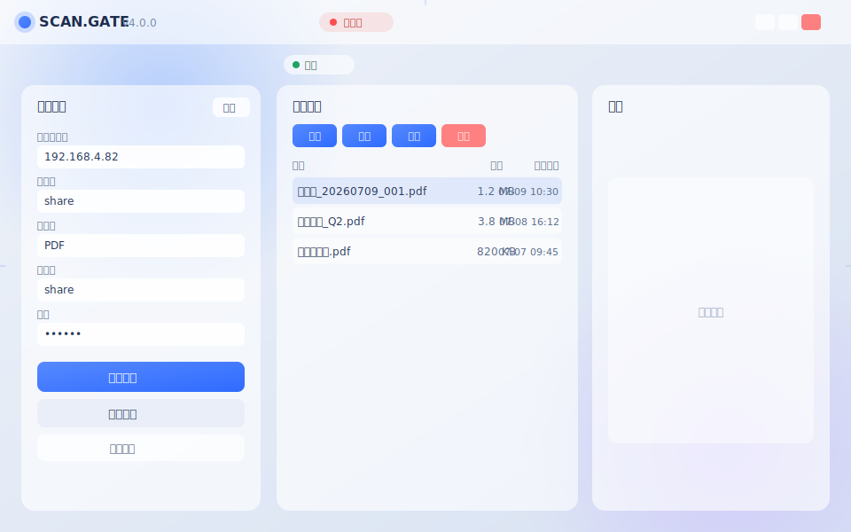
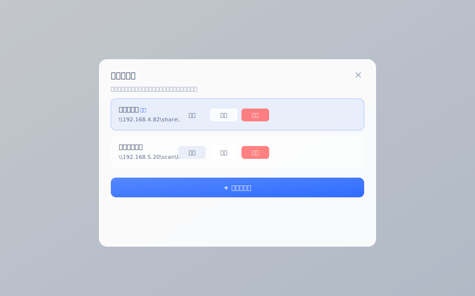

# SCAN.GATE 打印机扫描共享工具 · 产品使用指南

> 版本：v4.0.0 ｜ 适用对象：运营 / 行政 / 普通办公用户  
> 本文档按「从入门到进阶」顺序编排，每步均含**操作目的 · 操作方法 · 预期结果**，并在关键处给出注意事项与常见问题提示。

---

## 一、产品简介与功能概述

SCAN.GATE 是一款连接公区打印机网络扫描共享目录的桌面工具，帮助你在电脑上**浏览、预览、上传、下载、删除**扫描出来的 PDF 文件，无需手动映射网络驱动器。

**核心功能**

| 功能 | 说明 |
|------|------|
| 服务器连接 | 输入带用户名/密码的 SMB 共享路径（如 `\\192.168.4.82\share\PDF`），一键连接 |
| 文件浏览 | 列表展示扫描件名称、大小、修改时间，支持刷新 |
| 文件预览 | 选中 PDF 即时生成缩略预览，多页文档可翻页 |
| 上传 / 下载 | 把本地文件传入共享目录，或把扫描件保存到本机 |
| 删除 | 清理过期扫描件（带二次确认，防误删） |
| 多服务器管理 | 保存多组服务器配置，一键切换，支持增 / 改 / 删 |
| 会话溯源日志 | 每次「连接→断开」自动在共享目录写一份中文操作日志 |
| 窗口自由操控 | 无边框毛玻璃界面，支持标题栏拖动、八向缩放、最大化 |

**界面一览（示意图，以实际程序为准）**

*图 1 · 主界面布局：顶部标题栏（品牌 + 连接状态 + 窗口按钮）、左侧「连接设置」、中间「文件列表」、右侧「预览」、窗口四周为缩放热区。*

---

## 二、环境要求与启动

- **操作系统**：Windows 10 / Windows 11（系统已自带 Edge WebView2 运行环境，无需额外安装）。
- **网络**：与目标打印机/共享服务器在同一内网，且拥有该共享目录的访问账号。
- **启动方式**：双击 `打印机扫描工具_v4.exe` 即可。程序为**单实例**——若已在运行，再次双击只会提示而不会打开第二个窗口。

> ⚠️ **注意**：程序不依赖外部浏览器，但首次启动需系统 WebView2 组件。若公司电脑禁用了系统组件导致白屏，请联系 IT 确认 WebView2 已启用。

> 💡 **提示**：建议将 `打印机扫描工具_v4.exe` 固定到任务栏或发送到桌面快捷方式，便于日常使用。

---

## 三、入门操作

### 步骤 1 · 认识主界面并连接默认服务器

- **操作目的**：建立与打印机扫描共享目录的连接，是后续所有操作的前提。
- **操作方法**：
  1. 程序启动后，左侧「连接设置」面板已预填默认服务器（`192.168.4.82` / `share` / `PDF` / 账号 `share`）。
  2. 确认信息无误，点击蓝色按钮 **「连接共享」**。
- **预期结果**：顶部状态栏显示「已连接」，连接状态指示灯由**红色变为绿色**；中间「文件列表」开始加载并显示扫描件。
- 📷 **截图指示**：连接成功后，截取主界面，重点展示左上角连接指示灯变绿、中间文件列表出现文件行。

> ⚠️ **注意**：若提示连接失败，请检查：① 电脑与打印机是否在同一网段；② 共享地址/共享名/子目录/账号密码是否填写正确；③ 账号是否被服务器锁定。详见文末「故障排除」。

---

### 步骤 2 · 浏览与刷新文件列表

- **操作目的**：查看当前共享目录中有哪些扫描件。
- **操作方法**：
  - 文件列表已自动加载；如需手动刷新，点击列表上方 **「刷新」** 按钮。
- **预期结果**：列表按「名称 / 大小 / 修改时间」三列展示所有文件；新扫描的文件在刷新后出现。
- 📷 **截图指示**：截取文件列表面板，展示若干 PDF 行及表头三列。

> 💡 **提示**：文件名带日期（如 `扫描件_20260709_001.pdf`）便于识别扫描时间。

---

### 步骤 3 · 预览扫描件内容

- **操作目的**：在下载/删除前先确认内容，避免误操作。
- **操作方法**：在文件列表中**单击任意文件行**。
- **预期结果**：右侧「预览」面板显示该 PDF 首页图像；若为多页文档，面板底部出现 **「‹ 上一页 / 下一页 ›」** 翻页控件。
- 📷 **截图指示**：选中一个文件后，截取右侧预览面板显示文档图像、底部翻页控件的画面。

> ⚠️ **注意**：文件夹（目录）不支持预览，选中后会提示「文件夹不支持预览」。

---

### 步骤 4 · 下载文件到本机

- **操作目的**：把需要的扫描件保存到自己的电脑。
- **操作方法**：
  1. 在文件列表中**单击选中**目标文件（确保不是文件夹）。
  2. 点击 **「下载」** 按钮。
  3. 在弹出的系统「选择保存位置」对话框中指定路径并确认。
- **预期结果**：文件保存到指定位置，进度条短暂显示后完成；状态栏提示成功。
- 📷 **截图指示**：截取点击「下载」后弹出的系统「另存为」对话框。

> ⚠️ **注意**：未连接共享或尚未选中文件时点击「下载」，会弹出提示「请先连接共享 / 请先选择要下载的文件」，操作不会执行。

---

## 四、进阶操作

### 步骤 5 · 上传文件到共享目录

- **操作目的**：将本地文件（如已签字的回执）回传到扫描共享目录，供他人取用。
- **操作方法**：点击 **「上传」** 按钮，在文件选择对话框中选中要上传的文件（可多选），确认后等待上传完成。
- **预期结果**：上传成功后，刷新文件列表可见新文件；会话日志会记录本次上传。
- 📷 **截图指示**：截取点击「上传」后弹出的系统文件选择对话框（可多选状态）。

---

### 步骤 6 · 删除过期扫描件

- **操作目的**：清理共享目录中不再需要的文件，释放空间。
- **操作方法**：
  1. 单击选中要删除的文件。
  2. 点击 **「删除」** 按钮。
  3. 在确认框中点击「确定」（此操作不可恢复）。
- **预期结果**：文件从列表中移除，并从共享目录删除；会话日志记录删除操作。
- 📷 **截图指示**：截取点击「删除」后弹出的确认对话框（含文件名与「不可恢复」警示）。

> ⚠️ **注意事项（重要）**：
> - 删除前务必通过「预览」确认内容，避免误删他人文件。
> - **已断开连接时无法删除**：指示灯为红色（未连接）时点「删除」会被拦截并提示「请先连接共享后再删除」。
> - 删除动作会写入溯源日志，操作人可追溯，请谨慎使用。

---

### 步骤 7 · 管理多组服务器配置

- **操作目的**：在多个打印机/共享位置之间快速切换，免去反复手填。
- **操作方法**：
  1. 点击左侧面板标题旁的 **「管理」** 按钮，打开「服务器管理」弹窗。
  2. 在弹窗中可：
     - **连接**：把某配置切换为当前使用项（主面板同步填充）。
     - **编辑**：修改该配置的名称/地址/账号等。
     - **删除**：移除该配置（至少保留一项，不可清空）。
     - **+ 添加服务器**：新建一组配置，填写「配置名称 / 服务器地址 / 共享名 / 子目录 / 用户名 / 密码」后保存。
  3. 完成后点击弹窗空白处或右上角 × 关闭。
- **预期结果**：配置被保存并持久化；「当前」徽标标记正在使用的服务器。
- 📷 **截图指示**：截取「服务器管理」弹窗，展示含「当前」徽标的配置列表与「+ 添加服务器」按钮。

*图 2 · 服务器管理弹窗：列出已保存配置，每项含「连接 / 编辑 / 删除」，底部可新增。*

> 💡 **提示**：把常用的公区打印机设为「当前」配置，下次启动即自动预填，直接点「连接共享」即可。

---

### 步骤 8 · 窗口移动、缩放与最大化

- **操作目的**：根据屏幕空间自由调整窗口大小与位置。
- **操作方法**：
  - **移动**：在顶部标题栏空白处（品牌名区域）按下并拖动。
  - **八向缩放**：将鼠标移到窗口**上 / 下 / 左 / 右 / 四角**边缘，光标变为双向箭头后拖动，即可从对应方向改变大小（最小 760×480）。
  - **最大化 / 还原**：点击右上角最大化按钮，或**双击标题栏**。
  - **最小化 / 关闭**：点击右上角对应按钮。
- **预期结果**：窗口随拖动实时变化；最大化后缩放热区自动禁用，避免误触。
- 📷 **截图指示**：截取鼠标悬停在窗口右下角时显示斜向缩放箭头的画面。

> ⚠️ **注意**：拖动请使用标题栏区域，不要在文件列表/按钮上拖，否则不会移动窗口。

---

### 步骤 9 · 查看「关于」与联系作者

- **操作目的**：了解版本信息，或在需要时联系程序作者。
- **操作方法**：点击左侧 **「关于程序」**，弹窗显示名称、版本、作者、版权；点击作者名，选择「公司内 / 公司外」身份后跳转对应飞书邀请链接。
- **预期结果**：弹出「关于 SCAN.GATE」窗口；选择身份后浏览器打开联系入口。
- 📷 **截图指示**：截取「关于」弹窗及随后出现的「公司内 / 公司外」选择弹窗。

---

## 五、会话溯源日志

- **日志位置**：自动写入当前所连服务器的共享根目录下 `share\log` 文件夹，即 `\\<服务器IP>\share\log\`。
- **文件命名**：`log_YYYYMMDD_HHMMSS.log`（以本次连接开始时间命名，精确到秒，避免重名）。
- **记录内容**：一次「连接 → 断开」（或关闭窗口）会话内的全部操作，含操作时间、操作人、前后状态对比、结果。
- **溯源价值**：操作人默认取本机 Windows 登录账号；如需显示友好姓名，可在配置文件 `~\.printer_scan_config.json` 中加入 `"operator":"你的姓名"`。

> 💡 **提示**：日志仅在**成功连接后产生操作、再断开**时生成。仅浏览不操作也会生成一条含连接/断开信息的会话记录。

---

## 六、注意事项汇总

1. **先连接，后操作**：上传 / 下载 / 删除都要求处于「已连接」状态；断开后按钮会被拦截并提示。
2. **删除需谨慎**：删除有二次确认且写入日志，操作可追溯，误删不可恢复。
3. **单实例限制**：程序只能同时运行一个，重复启动会被提示。
4. **网络依赖**：所有文件操作依赖内网共享可达，离网或 VPN 断开会导致连接失败。
5. **配置持久化**：服务器配置保存在本机 `~\.printer_scan_config.json`，重装系统前请备份。

---

## 七、故障排除（FAQ）

| 现象 | 可能原因 | 解决办法 |
|------|----------|----------|
| 双击后无窗口 / 白屏 | 系统 WebView2 组件缺失或被禁用 | 确认 Win10/11 已启用 Edge WebView2；联系 IT 修复系统组件 |
| 提示「连接失败」 | 地址/账号错误、不在同网段、服务器不可达 | 核对 IP、共享名、子目录、用户名、密码；用 `ping <IP>` 测试连通性 |
| 文件列表为空 | 已连接但目录无文件，或子目录填错 | 检查「子目录」是否应为空或具体文件夹名（如 `PDF`） |
| 点「下载/删除」没反应并弹提示 | 未连接或没选中文件 | 先「连接共享」，再在列表单击选中具体文件 |
| 指示灯是红色仍想操作 | 当前处于「未连接」状态 | 重新点击「连接共享」；断开后列表已清空属正常 |
| 重建后 exe 图标没变 | Windows 资源管理器图标缓存未刷新 | 桌面按 **F5** 刷新，或重启「资源管理器」，或执行 `ie4uinit.exe -show` 清缓存 |
| 提示「程序已在运行」 | 已有一个实例 | 切到已打开的窗口，或结束后台进程后再启动 |
| 日志没生成 | 未成功连接，或共享 `log` 目录无写权限 | 确认先连接并产生操作；检查对 `\\<IP>\share` 是否有写入权限 |
| 预览不显示 | 文件非 PDF / 文件损坏 / 正在生成 | 刷新重试；非 PDF 文件不支持预览 |

> 若以上方法无法解决，请将现象截图及 `\\<IP>\share\log` 下对应日志文件一并反馈给作者。

---

*— 文档结束 —*
